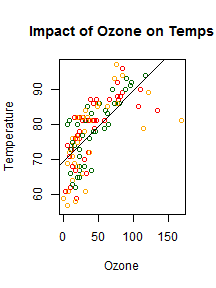

### Introduction

Analysis of Airquality Dataset: <b>Daily air quality measurements in New York, May to September 1973</b> to determine the impact of rising Ozone levels and Solar Radiation on daily Temperature.

### Dataset used 

Airquality dataset from the "Datasets" Package in R. 

### Tools used for analyis and presentation

R Programming Language
 
Shiny Apps
 
Slidify
 

--- .class #id 

## Intent and Assumptions

It is no secret that higher levels of Ozone lead to higher temperatures. Like wise, does Hot days imply higher Solar Radiation? 
How does Wind affect Temperature? The following analysis uses ShinyApps and R to analyse the 1973 New York Airquality dataset, in an attempt to answer these pertinent questions. 

### Assumptions
Following assumptions are made during the analysis process. 

Three variables were choses as Predictors  
* Ozone
* Solar.R 
* Wind  

Temperature is chosen as the outcome. 

--- .class #id 

## Method
Developed Interactive interface using ShinyApps and R  to 

    * Allow end-user to choose a Predictor
    * Create scatter plot of Temperature against Predictor
    * Perform Linear regression analysis between Temperature and predictor
    * Plot regression line on scatter plot
    * State Null Hypothesis and Alternate Hypothesis
    * Present p-value to determine validity of Null Hypothesis
    * Present correlation between predictor and temperature.
    

--- .class #id2 

## Sample Output & Thank yous!
Following is a sample graph plotting Temperature against Ozone. 

To view the shinyApp go to https://anushaiyengar.shinyapps.io/shiny_aq/

I'd like to thank Coursera and Prof. Brian Caffo of Johns Hopkins Institute for teaching this course and making it affordable. 
Airquality Data is from the Datasets package in R. 
Hope you enjoyed watching my presentation. Look forward to your feedback on this project. Thank you!!
